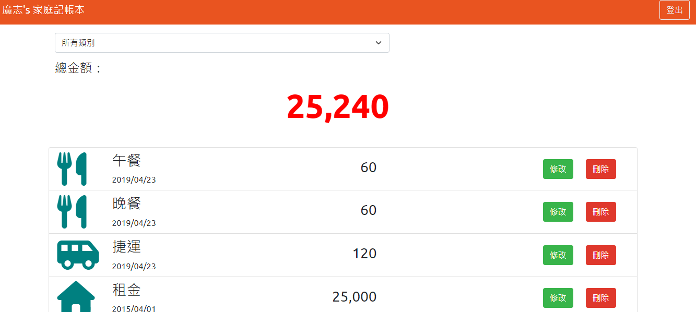

# Expense-Tracker

此專案提供一個簡單的網路記帳工具
## Features
* 使用者可以註冊帳號
* 使用者可以登入帳號
* 使用者可以透過Facebook Login 直接登入
* 登入後，使用者可以瀏覽全部支出紀錄
* 登入後，使用者可以篩選類別支出紀錄
* 登入後，使用者可以新增一筆支出紀錄
* 登入後，使用者可以修改一筆支出紀錄
* 登入後，使用者可以刪除一筆支出紀錄
* 使用者可以登出

## Getting Started
1. 將專案 clone 到本機
```bash
git clone https://github.com/GallonShih/expense-tracker.git
```
2. 透過 npm 安裝相關套件
```bash
npm install
```
3. 根據 .env.example 設定 .env

4. 設定完畢後，建立初始化Dataset(請確認本機已安裝MongoDB，並已啟動DB及建立Dataset "expense-tracker")
```bash
npm run seed
```
5. 啟動 web server
```bash
npm run dev
```
6. 等待終端機出現
```bash
Express is listening on localhost:3000
mongodb connected!
```
7. 於網址輸入 http://localhost:3000/users/login ，進入登入頁

8. 可以使用測試帳號，Email：user1@example.com，密碼：12345678

9. 若要暫停使用
```bash
ctrl + c
```

## Authors

* **Gallon Shih**

## Development Tools

* Node.js: 14.16.0
* Express: 4.17.2
* Express-Handlebars: 3.0.0
* Express-Session: 1.17.1
* body-parser: 1.19.1
* mongoose: 6.1.6
* method-override: 3.0.0
* passport: 0.4.1
* passport-local: 1.0.0
* passport-facebook: 3.0.0
* bcryptjs: 2.4.3
* connect-flash: 0.1.1
* dotenv: 8.2.0
* moment: 2.29.2
